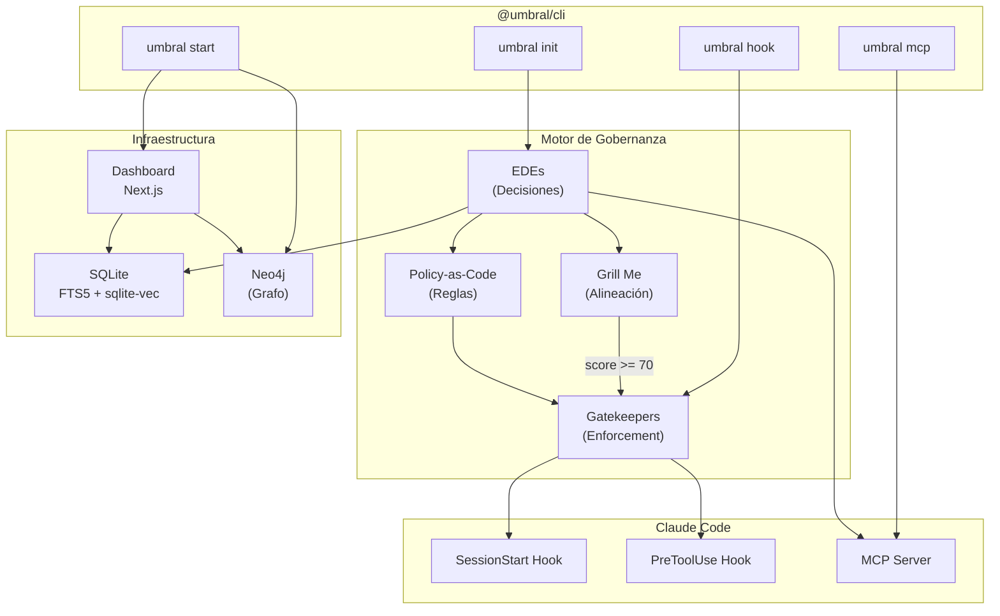
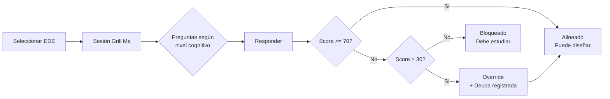
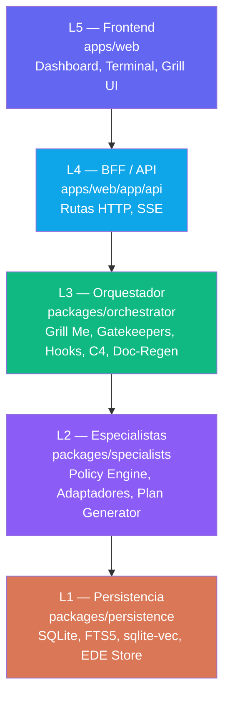
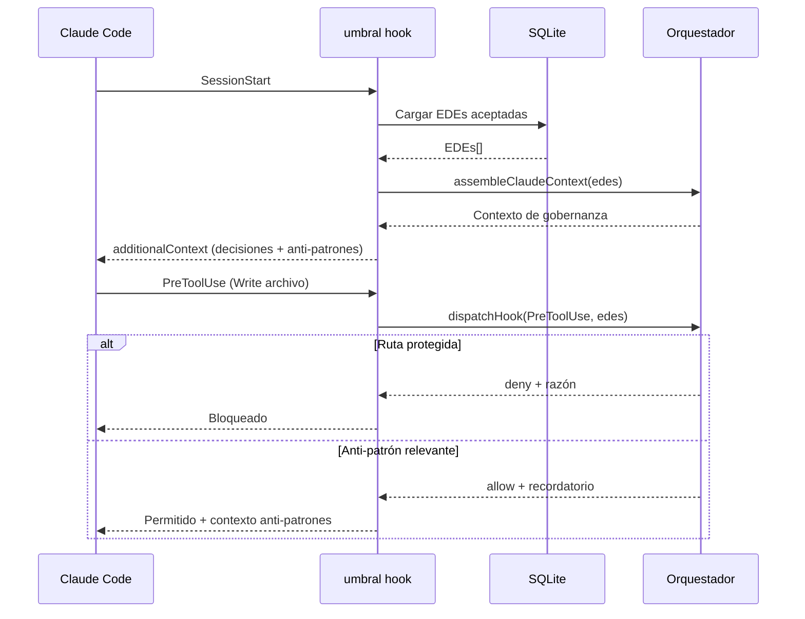
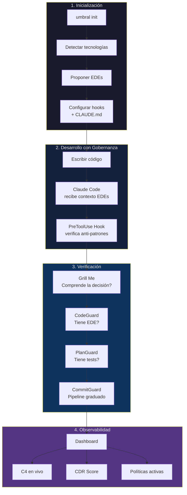

# Umbral

Framework de gobernanza para proyectos que usan Claude Code. Convierte decisiones arquitectónicas en reglas vivas que se verifican automáticamente durante el desarrollo.

```
npm install -g @umbral/cli
```

## Qué es Umbral

Umbral es un sistema local-first que formaliza las decisiones de diseño de un proyecto y las convierte en políticas ejecutables. En vez de documentar decisiones en un wiki que nadie lee, Umbral las almacena como **EDEs** (Estructuras de Decisión Explícitas) y las aplica a través de **gatekeepers**, **hooks** y un **motor de políticas** integrado con Claude Code.



## Instalación

### Requisitos

- **Node.js** 18+
- **Docker Desktop** (para el dashboard)

### Instalar el CLI

```bash
npm install -g @umbral/cli
```

### Inicializar en un proyecto

```bash
cd tu-proyecto
umbral init
```

Esto hace tres cosas:

1. **Analiza tu proyecto** — detecta tecnologías (frameworks, bases de datos, testing, etc.)
2. **Propone EDEs** — genera decisiones de gobernanza basadas en lo detectado
3. **Configura Claude Code** — crea `.claude/settings.json` con hooks y `.claude/CLAUDE.md` con el contexto de gobernanza

### Levantar el dashboard

```bash
umbral start
```

Descarga la imagen Docker desde `ghcr.io/josephrobles23/umbral-web`, levanta Neo4j + el dashboard web, y muestra las URLs:

```
  ✓ Umbral corriendo
    Dashboard:  http://localhost:3000
    Neo4j:      http://localhost:7474
    WebSocket:  ws://localhost:3099

  Para detener:  umbral stop
```

### Detener

```bash
umbral stop
```

## Conceptos

### EDE — Estructura de Decisión Explícita

Una EDE es una decisión arquitectónica formalizada. No es un ADR (Architecture Decision Record) pasivo — es un documento vivo que genera políticas, alimenta gatekeepers y se verifica en cada commit.

```
EDE-000-persistence
├── Qué y Cómo    → "SQLite con FTS5 + sqlite-vec como sustrato local-first"
├── Por Qué       → "Cero servicios externos, atomicidad entre índices"
├── Qué NO hacer  → "No abrir múltiples conexiones de escritura"
├── Contratos     → L1→L2: toda mutación pasa por DocRegenEvent
├── Tests         → unitTests, sadPaths, coverageTarget
└── Nivel         → explorer | navigator | anchor
```

Cada EDE tiene un **nivel cognitivo** que determina la profundidad de verificación:

| Nivel | Complejidad | Ejemplo |
|-------|-------------|---------|
| **Explorer** | Decisiones fundacionales | "Usamos SQLite" |
| **Navigator** | Decisiones intermedias | "El DSL de políticas es JSON declarativo" |
| **Anchor** | Invariantes del sistema | "S2 es la única fuente de cambios" |

### Grill Me — Verificación de Alineación

Antes de avanzar con una decisión, Grill Me evalúa si el desarrollador realmente la comprende. No es un examen — es una conversación estructurada.



- **Score >= 70**: Alineado — puede avanzar a la fase de diseño
- **Score 30–69**: Override disponible — avanza pero se registra la diferencia como **deuda cognitiva**
- **Score <= 30**: Bloqueado — el piso de seguridad impide continuar

### Gatekeepers — Enforcement Graduado

Tres guardianes verifican el cumplimiento en diferentes momentos:

| Gatekeeper | Cuándo | Qué verifica | Modo |
|------------|--------|--------------|------|
| **CodeGuard** | Pre-diseño | El cambio tiene una EDE aceptada? | Coercivo (bloqueo duro) |
| **PlanGuard** | Fase de diseño | Hay tests unitarios y sad-paths? | Normativo (override con razón) |
| **CommitGuard** | Pre-commit | Pipeline de tests graduado (impacto, dirigido, completo) | Adaptivo (escala según impacto) |

### Policy-as-Code — Reglas derivadas de EDEs

Cada anti-patrón en una EDE se convierte automáticamente en una política evaluable en runtime:

```
Anti-patrón en EDE-000:
  "No abrir múltiples conexiones de escritura concurrentes"

    ↓ se convierte en ↓

Política:
  { effect: "deny",
    condition: { field: "action.target", operator: "contains", value: "concurrent_write" },
    sourceEdeId: "EDE-000-persistence" }
```

El motor evalúa estas políticas cuando se intenta una acción. Si alguna coincide, retorna `deny` o `require_approval` con la razón.

### Deuda Cognitiva (CDR)

Cuando un desarrollador hace override en Grill Me, la diferencia entre el umbral (70) y su score real se registra como deuda. El **CDR (Cognitive Debt Ratio)** agrega toda la deuda acumulada:

| CDR | Estado | Significado |
|-----|--------|-------------|
| 0.00–0.15 | Saludable | Overrides justificados y ocasionales |
| 0.15–0.40 | Advertencia | Acumulando deuda técnica |
| 0.40+ | Crítico | Demasiados atajos, la gobernanza se degrada |

### Capas (L1–L5)

Umbral está organizado en 5 capas con contratos estrictos entre ellas:



Cada capa solo habla con la inmediatamente inferior. L5 nunca accede a L1 directamente.

### Modelo C4 — Arquitectura Viva

Umbral auto-genera diagramas C4 (System, Container, Component, Code) a partir de los DocNode del proyecto. Cuando S2 detecta un cambio, el modelo C4 se re-proyecta solo para las capas afectadas y se transmite en tiempo real vía SSE al dashboard.

### Doc-Regen (S2) — Fuente Única de Cambios

Solo el subsistema S2 detecta cambios en el código. Calcula el scope mínimo afectado y emite un `DocRegenEvent`. Los demás subsistemas (C4, embeddings, contratos) reaccionan a ese evento — ninguno observa el filesystem directamente.

## Integración con Claude Code

Umbral se integra con Claude Code a través de dos mecanismos:

### Hooks

Cuando Claude Code inicia una sesión o intenta usar una herramienta, Umbral intercepta via hooks:



### Servidor MCP

El comando `umbral mcp` expone las EDEs y herramientas de gobernanza como un servidor MCP que Claude Code puede consultar directamente:

| Herramienta MCP | Descripción |
|-----------------|-------------|
| `umbral_ede_list` | Listar todas las EDEs (filtrable por status) |
| `umbral_ede_get` | Obtener una EDE completa por ID |
| `umbral_ede_search` | Buscar EDEs por texto |
| `umbral_context` | Obtener el contexto completo de gobernanza |
| `umbral_grill_status` | Ver sesión Grill activa y deudas cognitivas |
| `umbral_semantic_search` | Búsqueda full-text en el historial de sesiones |
| `umbral_gate_check` | Validar contra CodeGuard y PlanGuard |

## Estructura del Monorepo

```
umbral/
├── apps/
│   └── web/                   # Dashboard Next.js 15 + React 19
│       ├── app/(shell)/       # Páginas: dashboard, operatives, grill, c4, terminal
│       ├── app/api/           # Rutas API (L4)
│       ├── components/        # UI: sidebar, cards, grill panel, terminal
│       └── Dockerfile         # Imagen de producción (standalone)
├── packages/
│   ├── cli/                   # @umbral/cli — CLI publicado en npm
│   ├── contracts/             # Tipos TypeScript compartidos (L0)
│   ├── persistence/           # SQLite + FTS5 + sqlite-vec (L1)
│   ├── orchestrator/          # Grill, Gatekeepers, Hooks, C4 (L3)
│   ├── specialists/           # Policy Engine, Adaptadores (L2)
│   ├── graph/                 # Conexión Neo4j (L1)
│   └── mcp-server/            # Servidor MCP para Claude Code
├── docker-compose.yml         # Neo4j + Dashboard
├── turbo.json                 # Pipeline de build
└── pnpm-workspace.yaml        # Workspace config
```

## Comandos del CLI

| Comando | Descripción |
|---------|-------------|
| `umbral init` | Analiza el proyecto, propone EDEs, configura hooks y CLAUDE.md |
| `umbral start` | Levanta Neo4j + Dashboard via Docker |
| `umbral stop` | Detiene los contenedores |
| `umbral hook <event>` | Despacha hooks de Claude Code (usado internamente) |
| `umbral mcp` | Inicia el servidor MCP (transporte stdio) |

## Flujo Completo



## Subsistemas

| ID | Capa | Rol | Ubicación |
|----|------|-----|-----------|
| S1 | L3 | Grill Me — sesiones de alineación | `packages/orchestrator/src/grill.ts` |
| S2 | L3 | Doc-Regen — detección de cambios | `packages/orchestrator/src/doc-regen.ts` |
| S3 | L3 | Hooks — registro y despacho | `packages/orchestrator/src/hooks.ts` |
| S4 | L2 | Policy Engine — evaluación de políticas | `packages/specialists/src/policy-engine/` |
| S5 | L3 | Contratos — verificación de invariantes | `packages/orchestrator/src/layers.ts` |
| S6 | L3 | C4 — proyección de arquitectura | `packages/orchestrator/src/c4.ts` |
| S7 | L1 | Semantic Store — búsqueda full-text (FTS5) | `packages/persistence/src/semantic-store.ts` |
| S8 | L1 | Embeddings — búsqueda vectorial | `packages/persistence/src/embedding-index.ts` |
| S9 | L2 | Langfuse Adapter — trazas de comprensión | `packages/specialists/src/adapters/langfuse-adapter.ts` |
| S10 | L2 | DevTools Adapter — logs del navegador | `packages/specialists/src/adapters/devtools-adapter.ts` |
| S11 | L2 | Plan Generator — planes técnicos y de negocio | `packages/specialists/src/plan-generator/` |
| S12 | L3 | Gatekeepers — CodeGuard, PlanGuard, CommitGuard | `packages/orchestrator/src/gates/` |
| S13 | Todos | Fail-fast — validación en límites de capa | Distribuido |

## Desarrollo Local

```bash
# Clonar e instalar
git clone https://github.com/JosephRobles23/Umbral-hack.git
cd Umbral-hack
pnpm install

# Desarrollo (sin Docker)
pnpm dev

# Build completo
pnpm build

# Tests
pnpm test

# Typecheck
pnpm typecheck
```

## Principios de Diseño

- **Local-first**: Todo vive en `~/.umbral/umbral.db`. Cero servicios externos requeridos.
- **Fail-fast (S13)**: Datos inválidos se rechazan inmediatamente en el límite de cada capa.
- **Fuente única (S2)**: Solo un subsistema detecta cambios. Los demás reaccionan.
- **Override transparente**: Los atajos son permitidos pero siempre registrados como deuda.
- **Slices verticales**: Cada incremento toca L1 a L5 y deja la app funcional.
- **Dogfooding**: Desde el Slice 5, Umbral gobierna su propio desarrollo.

## Licencia

Proprietary
